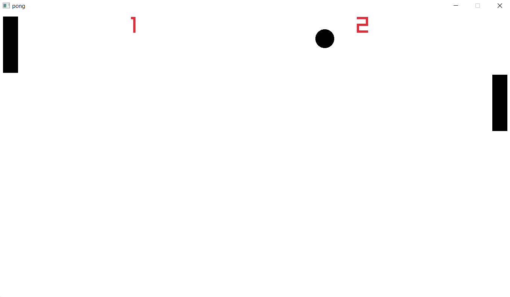

<h3 align="center">
    Pong
</h3>

---

    :gear: This is a pong create in C with Raylib.

---

### 🖼️ Screenshot

### :question: How to use the build script
Before building, make sure you have a C compiler installed on your computer.

~~~console
# windows
$ cc pong.c -o pong.exe -Wall -Wextra -pedantic -fno-common -fno-builtin -mwindows -Iinclude/ -Llib/ -lraylib -lopengl32 -lgdi32 -lwinmm

# linux
$ cc pong.c -o pong.exe -Wall -Wextra -pedantic -fno-common -fno-builtin -mwindows -Iinclude/ -Llib/ -lraylib -lGL -lm -lpthread -ldl -lrt

# macos
$ cc pong.c -o pong.exe -Wall -Wextra -pedantic -fno-common -fno-builtin -mwindows -Iinclude/ -Llib/ -lraylib -lGL -lm -lpthread -ldl -lrt -lX11
~~~

If you want a more customizable build method see [here](https://github.com/raysan5/raylib/blob/master/examples/Makefile).
If you want to build on android see [here](https://github.com/raysan5/raylib/blob/master/examples/Makefile.Android) and [here](https://github.com/raysan5/raylib/blob/master/examples/Makefile.Web) if you want to build for the web.
